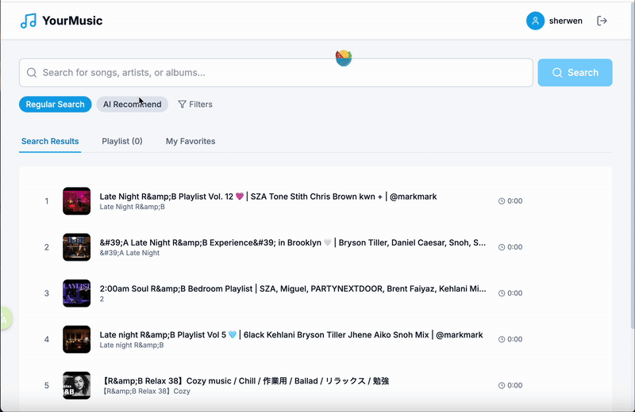

# YourMusic - AI Music Recommendation Platform

A smart music recommendation web application built with Next.js, React, DeepSeek API, YouTube API, and Firebase.

## Features

- AI-Powered Recommendations: Uses DeepSeek API for semantic music recommendations based on user descriptions
- YouTube Integration: Fetches music data and enables playback through YouTube Data API
- User Authentication: Firebase Auth integration with user registration and login
- Data Management: Firestore database for storing user preferences and playlists
- Modern UI: Responsive design with dark mode support
- Music Player: Built-in music player with playlist management
- Performance Optimization: SSR, lazy loading, and caching strategies
- Multi-language Support: English interface with i18n ready

## Tech Stack

### Frontend
- Next.js 14 - React full-stack framework
- React 18 - UI library
- TypeScript - Type safety
- Tailwind CSS - Styling framework
- Lucide React - Icon library
- React Hot Toast - Notification alerts

### Backend
- Next.js API Routes - Server-side APIs
- Firebase Auth - User authentication
- Firestore - NoSQL database
- JWT - Authentication tokens

### Third-party Services
- DeepSeek API - AI music recommendation
- YouTube Data API - Music data retrieval
- Firebase - Backend services

### Development Tools
- Jest - Testing framework
- ESLint - Code linting
- GitHub Actions - CI/CD

## Installation and Setup

### Requirements
- Node.js 18.x or higher
- npm or yarn
- Firebase project
- DeepSeek API key
- YouTube Data API key

### 1. Clone the Repository
```bash
git clone https://github.com/yourusername/yourmusicplaylist.git
cd yourmusicplaylist
```

### 2. Install Dependencies
```bash
npm install
```

### 3. Environment Configuration
Create a `.env.local` file and add your API keys:

```env
# DeepSeek API
OPENAI_API_KEY=your_deepseek_api_key

# YouTube API
YOUTUBE_API_KEY=your_youtube_api_key

# Firebase Configuration
FIREBASE_PROJECT_ID=your_firebase_project_id
FIREBASE_PRIVATE_KEY="your_firebase_private_key"
FIREBASE_CLIENT_EMAIL=your_firebase_client_email

# JWT Secret
JWT_SECRET=your_jwt_secret_key_here

# Next.js
NEXTAUTH_URL=http://localhost:3000
NEXTAUTH_SECRET=your_nextauth_secret_here
```

### 4. Firebase Setup
1. Create a Firebase project
2. Enable Authentication and Firestore
3. Download service account key
4. Configure Firebase security rules

### 5. Run Development Server
```bash
npm run dev
```

Visit http://localhost:3000 to view the application.

## Testing

Run the test suite:
```bash
# Run all tests
npm test

# Run tests with coverage report
npm run test:coverage

# Run tests in watch mode
npm run test:watch
```

## Deployment

### Vercel Deployment (Recommended)
1. Push code to GitHub
2. Import project in Vercel
3. Configure environment variables
4. Automatic deployment

### Docker Deployment
```bash
# Build image
docker build -t yourmusicplaylist .

# Run container
docker run -p 3000:3000 yourmusicplaylist
```

### Docker Compose Deployment
```bash
docker-compose up -d
```

## Project Structure

```
yourmusicplaylist/
├── app/                    # Next.js App Router
│   ├── api/               # API routes
│   │   ├── search/        # Search API
│   │   └── recommend/    # Recommendation API
│   ├── globals.css        # Global styles
│   ├── layout.tsx         # Root layout
│   └── page.tsx           # Home page
├── components/            # React components
│   ├── AuthModal.tsx     # Auth modal
│   ├── MusicPlayer.tsx   # Music player
│   ├── SearchBar.tsx     # Search bar
│   └── TrackCard.tsx      # Track card
├── contexts/             # React Context
│   ├── AuthContext.tsx    # Auth context
│   └── PlayerContext.tsx  # Player context
├── lib/                  # Utilities
│   ├── auth.ts           # Auth utilities
│   ├── firebase.ts       # Firebase config
│   ├── openai.ts         # DeepSeek integration
│   └── youtube.ts        # YouTube API
├── types/                # TypeScript types
│   └── index.ts           # Type definitions
├── __tests__/            # Test files
├── middleware.ts          # Next.js middleware
├── next.config.js        # Next.js config
├── tailwind.config.js     # Tailwind config
├── package.json          # Project dependencies
└── README.md            # Project documentation
```

## Configuration

### Firebase Security Rules
```javascript
rules_version = '2';
service cloud.firestore {
  match /databases/{database}/documents {
    // User data
    match /users/{userId} {
      allow read, write: if request.auth != null && request.auth.uid == userId;
    }
    
    // Playlists
    match /playlists/{playlistId} {
      allow read, write: if request.auth != null && 
        (resource.data.userId == request.auth.uid || resource.data.isPublic);
    }
  }
}
```

### API Endpoints
- `POST /api/search` - Search music
- `POST /api/recommend` - AI recommendation

## Core Features

### AI Music Recommendation
The system uses DeepSeek API to analyze user intent and generate search keywords and tags, rather than recommending specific songs. This approach is more flexible and enables dynamic searches based on YouTube's content library.

### Search Workflow
1. User enters music description (e.g., "relaxing jazz for work")
2. DeepSeek analyzes and generates relevant keywords and tags
3. Search YouTube API using these keywords
4. Return music playlist

### Player Features
- Current playing track display
- Playlist management
- Playback progress control
- Open in YouTube

## Usage

### Search Music
1. Enter keywords in the search box
2. Click the search button
3. Browse search results
4. Click tracks to add to playlist

### AI Recommendation
1. Switch to AI recommendation mode
2. Describe the music you want (e.g., "relaxing country music")
3. System generates recommendations
4. View AI recommendation reasoning

### Playlist Management
1. Click tracks to add to playlist
2. Switch to "Playlist" tab to view
3. Play, pause, or skip tracks
4. Click "Open in YouTube" to open in browser

## Demo





## Contributing

1. Fork the repository
2. Create your feature branch (`git checkout -b feature/AmazingFeature`)
3. Commit your changes (`git commit -m 'Add some AmazingFeature'`)
4. Push to the branch (`git push origin feature/AmazingFeature`)
5. Open a Pull Request

## License

This project is licensed under the MIT License - see the LICENSE file for details.

## Acknowledgments

- Next.js - React framework
- Firebase - Backend services
- DeepSeek - AI services
- YouTube - Music data
- Tailwind CSS - CSS framework
- Vercel - Deployment platform

## Contact

For questions or suggestions, please contact us:

- GitHub: Open an issue
- Project URL: https://github.com/yourusername/yourmusicplaylist

If you find this project helpful, please give it a star!